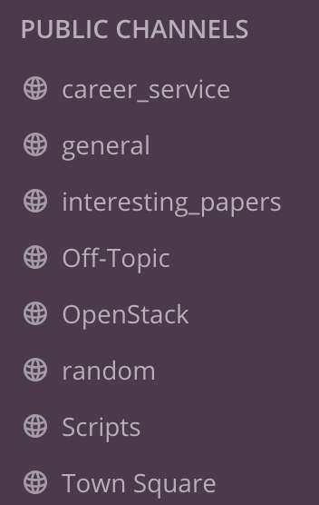

## New starter checklist

First off, hello and welcome to Teichlab! Below you'll find a list of things that are good to set up as a new person in the lab. 

First order of business:
* Use your Sanger login credentials to get access to:
  * [VPN](https://www.sanger.ac.uk/covid/)
  * Mattermost. Open the Mattermost app that comes installed on the laptop, and add a new server under server management. Provide https://mattermost.sanger.ac.uk/teichmann as the address, and Teichmann Group as the display name. You'll be able to access Mattermost both via the app, and also at mattermost.sanger.ac.uk in a browser. Once within the server, join the following channels:

* Write servicedesk (at sanger.ac.uk) asking for iRODS access, and being added to group team205 on it.
* Acquire GitHub credentials if you don't have them, and write the following people on Mattermost:
  * Martin Prete (mp33), asking for access to JupyterHub.
  * Krzysztof Polanski (kp9), asking for membership in the Teichlab GitHub organisation, granting access to [Scripts](https://github.com/Teichlab/mapcloud/tree/master/scripts) and [sctk](https://github.com/Teichlab/sctk) repositories.

More specialised:
* Write servicedesk to enrol for a farm course, which will allow cluster job submission once completed.
* Set up [rclone](https://cellgeni.readthedocs.io/en/latest/rclone.html) for Google Drive communication. Please avoid putting any sequence data (FASTQ/BAM/CRAM being the most common) there due to ethics.

For most analysis needs, JupyterHub is likely to suffice. There are more specialised resources available if need be:
* CellGenIT offer access to GPU notebooks, contact Martin Prete (mp33)
* Follow the [basecloud](https://github.com/Teichlab/basecloud) tutorial to create an OpenStack instance
